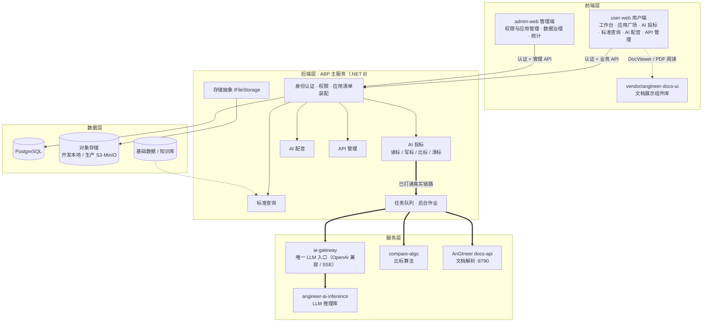
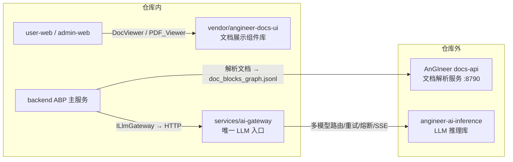

# DredgeAI — 面向港口/疏浚工程行业的 AI 应用平台

DredgeAI 是一套面向企业员工的 AI 工程应用工作区：用户端按「应用清单」动态装配业务应用，管理端提供权限、应用治理与统计分析。当前仓库包含用户端（user-web）、管理端（admin-web）两套前端，以及已打通真实链路的 **AI 投标-比标** 后端服务。

> 产品定位、用户角色与页面规格见 [docs/prd-ai-platform-prototype.md](docs/prd-ai-platform-prototype.md)。

## 功能总览

### 用户角色

| 角色 | 核心能力 |
|---|---|
| 普通员工 | 查看授权应用、发起任务、查看个人结果 |
| 专业岗位用户 | 使用专业场景应用（审标/比标/标准查询等）、管理任务文件、查看结构化结果 |
| 平台管理员 | 管理权限、应用、数据治理与统计分析（管理端） |

### 用户端（user-web）

| 应用 | 说明 | 状态 |
|---|---|---|
| 工作台 | 推荐任务、授权应用、最近任务/文件 | 原型 |
| 应用广场 | 按场景筛选 AI 应用并快速进入 | 原型 |
| AI 投标 | 读标 / 写标 / 比标 / 清标四个子应用 | **比标已接通真实链路**；读标（招标文件解读）开发中，写标/清标按规划推进 |
| 标准查询 | 标准/规范检索、阅读与 AI 对话（DocViewer） | 原型 |
| AI 配音 | 配音任务与音色管理 | 原型 |
| API 管理 | 开放接口查看/调试 | 原型 |
| 个人中心 | 用户资料与偏好 | 原型 |

### 管理端（admin-web）

工作台、组织用户、角色权限、应用管理（分组/上下架/版本/可见范围）、API 管理、知识库、基础配置、AI 配音管理、告警与分析、数据治理（上传审核/调用统计/成本分析）。

> 各页面详细功能规格与 UI 设计见 [PRD](docs/prd-ai-platform-prototype.md)。

### 比标模块（已打通真实链路）

创建比标任务 → 上传标书/招标文件 → AnGIneer 解析 → 算法产出相似度/报价/元数据证据 →（可选）LLM 条款判定与指标比选 → 结果工作台与报告导出。

端到端流程、状态与容错、已知限制见 [docs/bid-compare.md](docs/bid-compare.md)。

## 架构



> 图例：`==>` 表示已打通真实链路的调用（当前为比标纵向切片）；`-->` / `-.->` 为常规依赖与规划路径。业务模块按「应用清单」装配，除比标外当前均为前端原型，后端随规划逐步实现。

### 模块结构

| 目录 | 说明 |
|---|---|
| `backend/DredgeAI.BidCompare` | ABP（.NET 8）主服务：身份/权限（OpenIddict）、应用清单装配、任务与后台作业、存储抽象；当前已实现比标模块（状态机、AnGIneer 解析编排、算法调用、AI 分析、报告导出） |
| `services/compare-algo` | 比标算法服务（Python/FastAPI）：similarity / pricing / metadata，无状态确定性计算 |
| `services/ai-gateway` | AI 推理网关（Python/FastAPI）：平台唯一 LLM 入口，消费 angineer-ai-inference，提供 OpenAI 兼容 chat / SSE 流式 |
| `user-web` | 用户端前端（Vue 3 + Vite + ant-design-vue） |
| `admin-web` | 管理端前端 |
| `packages/shared` | 跨端共享类型 / 组件 / 样式 / 请求封装 |
| `vendor/angineer-docs-ui` | git submodule：文档展示组件库（`@angineer/docs-ui`） |
| `docs/` | PRD、数据架构、安全与部署文档（见文末导航） |

### AnGIneer 生态

「AnGIneer」在仓库中对应三个不同形态，注意区分：

| 名称 | 形态 | 位置 | 用途 |
|---|---|---|---|
| AnGIneer docs-api | 外部解析服务（:8790） | 仓库外 | 文档解析为 `doc_blocks_graph.jsonl` + meta，ABP 经 `HttpAnGineerClient` 调用 |
| angineer-docs-ui | git submodule | `vendor/angineer-docs-ui` | 前端文档展示组件库（`@angineer/docs-ui`），user-web 的 DocViewer / PDF_Viewer 消费 |
| angineer-ai-inference | Python 库（v0.1.0） | ai-gateway 依赖 | LLM 推理库：多模型路由 / 重试 / 熔断 / SSE，ai-gateway 包装为 OpenAI 兼容接口 |



> ai-gateway 是平台唯一 LLM 入口：ABP 的 `ILlmGateway` 与前端对话均经它转发，不直连模型。

### 关键设计约定

- **解析链路**：AnGIneer docs-api（:8790，仓库外）把文档解析为 `doc_blocks_graph.jsonl` + meta，后端适配为内部 IR；`.doc`/`.docx` 统一经 LibreOffice 按内容转 PDF。
- **存储分层**：开发模式为本地文件（`data/storage`），生产切 S3/MinIO；所有运行时数据统一放仓库根 `data/`。详见 [docs/data-architecture.md](docs/data-architecture.md)。

## 部署

前置依赖：Docker（PostgreSQL）、.NET 8 SDK、Node.js 18+ 与 pnpm、Python 3.11+（uv）、本机 AnGIneer docs-api（:8790，脚本仅检测不托管）。

一键部署（幂等，重复运行等于重启）：

```powershell
.\start.ps1           # 一键拉起全部服务
.\start.ps1 -TailLogs # 启动并实时跟随日志
```

脚本自动完成：清理残留进程 → 拉起 PostgreSQL → 启动 compare-algo、ai-gateway、比标后端与双前端 → 健康检查。日志在 `data/logs/`。

| 服务 | 地址 |
|---|---|
| 用户端 / 管理端 | http://localhost:5373 / :5374 |
| 比标后端（Swagger `/swagger`） | https://localhost:44361 |
| compare-algo / ai-gateway | http://localhost:8100 / :8200 |
| PostgreSQL | localhost:5432 |
| AnGIneer（外部依赖，仅检测） | http://localhost:8790 |

密钥与模型配置放仓库根 `.env`（已 gitignore，禁止提交）：

```dotenv
ANGINEER_API_KEY=xxx
LLM_CONFIGS='[...]'   # 多模型配置（JSON 数组）；为空时 AI 分析降级为「暂不可用」
AI_GATEWAY_BASE_URL=http://localhost:8200
```

生产环境：存储切 S3/MinIO、密钥轮换等，按 [生产 .env 检查清单](docs/security/production-env-checklist.md) 与 [密钥轮换手册](docs/security/key-rotation.md) 配置；存储与数据目录约定见 [docs/data-architecture.md](docs/data-architecture.md)。

## 开发与测试

> 全链路一键启动的唯一入口是 `.\start.ps1`；需要单服务调试时，按各服务标准方式运行即可（后端 `dotnet run`、前端 `pnpm dev`、Python `uvicorn`）。

```powershell
# 后端测试
dotnet test backend\DredgeAI.BidCompare\test\DredgeAI.BidCompare.Domain.Tests
dotnet test backend\DredgeAI.BidCompare\test\DredgeAI.BidCompare.Application.Tests
dotnet test backend\DredgeAI.BidCompare\test\DredgeAI.BidCompare.EntityFrameworkCore.Tests

# 算法服务
cd services\compare-algo; uv run pytest -q

# 前端
pnpm run typecheck
pnpm --filter user-web test
```

开发规范（TypeScript 严格模式、样式体系、后端 ABP 接口约定等）见 [AGENTS.md](AGENTS.md) 与 [docs/backend-ABP接口响应格式标准.md](docs/backend-ABP接口响应格式标准.md)。

## 文档导航

| 文档 | 内容 |
|---|---|
| [docs/prd-ai-platform-prototype.md](docs/prd-ai-platform-prototype.md) | 产品定位、用户角色、功能模块、页面规格与 UI 设计 |
| [docs/bid-compare.md](docs/bid-compare.md) | 比标模块：端到端流程、状态与容错、已知限制 |
| [docs/data-architecture.md](docs/data-architecture.md) | `data/` 目录分层、存储与备份约定 |
| [docs/backend-ABP接口响应格式标准.md](docs/backend-ABP接口响应格式标准.md) | 后端 API 响应格式与错误约定 |
| [docs/security/production-env-checklist.md](docs/security/production-env-checklist.md) | 生产环境配置检查清单 |
| [docs/security/key-rotation.md](docs/security/key-rotation.md) | 密钥轮换手册 |
| [backend/DredgeAI.BidCompare/README.md](backend/DredgeAI.BidCompare/README.md) | 后端解决方案结构（ABP 模板说明） |
