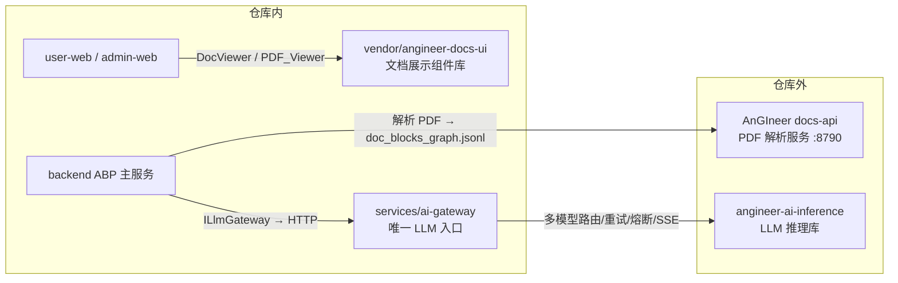

# DredgeAI — AI 工程应用平台

面向港口/疏浚工程行业的 AI 应用工作区。用户端与管理端均按「应用清单」动态装配，
当前仓库包含用户端、管理端前端，以及已打通真实链路的 **AI 投标-比标** 后端服务。

## 平台概览

**用户端（user-web）**：

| 应用 | 说明 |
|---|---|
| 工作台 | 用户首页 |
| 标准查询 | 标准/规范文档检索与阅读（DocViewer + AI 对话） |
| AI 投标 | 读标 / 写标 / 比标 / 清标四个子应用；**比标**已接通后端真实链路，其余按规划逐步完善 |
| AI 配音 | 配音任务与音色管理 |
| API 管理 | 开放接口查看/调试 |
| 个人中心 | 用户资料与偏好 |

**管理端（admin-web）**：工作台、组织用户、角色权限、应用管理、API 管理、知识库、
基础配置、AI 配音管理、告警与分析等。

## 模块结构

| 目录 | 说明 |
|---|---|
| `backend/DredgeAI.BidCompare` | ABP（.NET 8）主服务：比标任务状态机、AnGIneer 解析、算法调用、AI 分析、报告导出（含 ABP 身份/组织基础模块） |
| `services/compare-algo` | 比标算法服务（Python）：similarity / pricing / metadata，无状态确定性计算 |
| `services/ai-gateway` | AI 推理网关（Python）：唯一 LLM 入口，消费 angineer-ai-inference，提供 OpenAI 兼容 chat / SSE 流式 |
| `user-web` | 用户端前端（Vue 3 + Vite + ant-design-vue） |
| `admin-web` | 管理端前端 |
| `packages/shared` | 跨端共享类型 / 组件 / 样式 |
| `docs/superpowers/plans` | 需求与实现计划文档 |

## AnGIneer 生态

「AnGIneer」在仓库中对应三个不同形态，注意区分：

| 名称 | 形态 | 位置 | 用途 |
|---|---|---|---|
| AnGIneer docs-api | 外部解析服务（:8790） | 仓库外 | PDF 解析为 `doc_blocks_graph.jsonl` + meta，ABP 经 `HttpAnGineerClient` 调用 |
| angineer-docs-ui | git submodule | `vendor/angineer-docs-ui` | 前端文档展示组件库（`@angineer/docs-ui`），user-web 的 DocViewer / PDF_Viewer 消费 |
| angineer-ai-inference | Python 库（v0.1.0） | ai-gateway 依赖 | LLM 推理库：多模型路由 / 重试 / 熔断 / SSE，ai-gateway 包装为 OpenAI 兼容接口 |



> ai-gateway 是平台唯一 LLM 入口：ABP 的 `ILlmGateway` 与前端对话均经它转发，不直连模型。

## 快速启动

前置依赖：Docker（PostgreSQL）、.NET 8 SDK、Node.js + pnpm、Python 3.11+（compare-algo
与 ai-gateway 虚拟环境）、本机 AnGIneer docs-api 服务（端口 8790，仅检测不托管）。

一键启动（幂等，重复运行等于重启）：

```powershell
.\start.ps1
```

脚本会依次：清理 8100/8200/44361/5373 残留进程 → 拉起 PostgreSQL Docker 容器 → 启动
compare-algo、ai-gateway、比标后端、用户端/管理端前端 → 健康检查。日志在 `logs/`，实时跟随用
`.\start.ps1 -TailLogs`。

| 服务 | 地址 | 说明 |
|---|---|---|
| 用户端前端 | http://localhost:5373 | user-web |
| 比标后端 | https://localhost:44361 | ABP 主服务，Swagger `/swagger` |
| compare-algo | http://localhost:8100 | 比标算法服务 |
| ai-gateway | http://localhost:8200 | AI 推理网关（多模型路由/重试/熔断/SSE） |
| PostgreSQL | localhost:5432 | Docker 容器 `bidcompare-postgres` |
| AnGIneer | http://localhost:8790 | 外部依赖（docs-api），脚本仅检测 |

## 配置

密钥放仓库根目录 `.env`（已被 `.gitignore` 忽略，**禁止提交**）：

```dotenv
ANGINEER_API_KEY=xxx
# AI 推理网关（services/ai-gateway 消费 angineer-ai-inference@v0.1.0）
LLM_CONFIGS='[{"name":"Qwen3.6-A3B","model":"Qwen3.6-35B-A3B-FP8","api_key":"xxx","base_url":"https://ai.bim-ace.com/chat/v1","enabled":true,"priority":1}]'
AI_GATEWAY_BASE_URL=http://localhost:8200
AI_GATEWAY_API_TOKEN=
AI_GATEWAY_INGEST_TOKEN=
# 可选：ANGINEER_* 超时/重试/熔断参数（见 angineer-ai-inference 文档）
```

后端启动时自动读取 `.env` 并映射到 `AnGIneer:ApiKey` / `AiGateway:*`。LLM 模型配置统一由
`LLM_CONFIGS`（JSON 数组）提供给 ai-gateway，网关负责多模型优先级路由、指数退避重试、
熔断、截断守卫与 SSE 流式；ABP 仅经 `AI_GATEWAY_BASE_URL` 调用网关，不再直连模型。
`AI_GATEWAY_API_TOKEN` / `AI_GATEWAY_INGEST_TOKEN` 为空表示开发环境关闭令牌校验；
生产/共享环境必须配置并轮换，上线前逐项核对
[生产 .env 检查清单](docs/security/production-env-checklist.md) 与
[密钥轮换手册](docs/security/key-rotation.md)。

开发模式存储为本地文件（仓库根 `data/storage`），无需 MinIO；生产默认 S3/MinIO。
运行时数据统一放在仓库根 `data/`（基础数据 / 业务文件 / PostgreSQL / 日志 / 备份），
目录约定见 [docs/data-architecture.md](docs/data-architecture.md)。

## 开发命令

> 全链路一键启动的唯一入口是 `.\start.ps1`（PostgreSQL、compare-algo、ai-gateway、后端与双前端）；
> 以下命令仅用于单服务调试，不作为平台启动入口。

```powershell
# 比标后端（需先将 dotnet SDK 加入 PATH，或直接跑 start.ps1）
cd backend\DredgeAI.BidCompare
dotnet run --project src\DredgeAI.BidCompare.HttpApi.Host

# 用户端 / 管理端前端
cd user-web
pnpm dev
cd admin-web
pnpm dev

# compare-algo
cd services\compare-algo
uv run uvicorn app.main:app --host 127.0.0.1 --port 8100

# ai-gateway
cd services\ai-gateway
uv run uvicorn app.main:app --host 127.0.0.1 --port 8200
```

## 测试

```powershell
# 比标后端（70 个用例）
dotnet test backend\DredgeAI.BidCompare\test\DredgeAI.BidCompare.Domain.Tests
dotnet test backend\DredgeAI.BidCompare\test\DredgeAI.BidCompare.Application.Tests
dotnet test backend\DredgeAI.BidCompare\test\DredgeAI.BidCompare.EntityFrameworkCore.Tests

# 算法服务（192 个用例）
cd services\compare-algo
uv run pytest -q

# 前端类型检查
pnpm run typecheck
```

## 比标模块流程

创建比标任务 → 上传标书（role=0）与招标文件（role=1）→ AnGIneer 解析为
`doc_blocks_graph.jsonl` + meta → 映射/校验内部 IR → compare-algo 产出相似度、报价规律、
元数据一致性证据 →（可选）条款提取/确认 + 经 ai-gateway 的 LLM 条款响应判定与关键指标比选 →
结果工作台（证据、相似度热力图、PDF 对照）→ 导出 docx/pdf。

### 比标模块已知限制

- AnGIneer v1 产物接口目前只开放 graph/meta，`content.md` 与图片待其开放后自动随包下载。
- 前端「招标条款提取/确认」UI 尚未接真实接口（后端 API 已就绪）。
- LLM 未配置（`LLM_CONFIGS` 为空）时 AI 分析自动降级为「暂不可用」，算法证据不受影响；
  ai-gateway 未启动时 ABP 的 LLM 调用返回 `AiGatewayFailed`，AI 分析同样降级为暂不可用。

## 相关文档

- [比标算法服务计划](docs/superpowers/plans/2026-07-29-bid-compare-algo-service.md)
- [ABP 后端计划](docs/superpowers/plans/2026-07-29-bid-compare-abp-backend.md)
- [前端计划](docs/superpowers/plans/2026-07-29-ai-bid-compare-frontend.md)
- [AnGIneer 消费契约](docs/superpowers/plans/dredgeai-consume-angineer-requirements.md)
