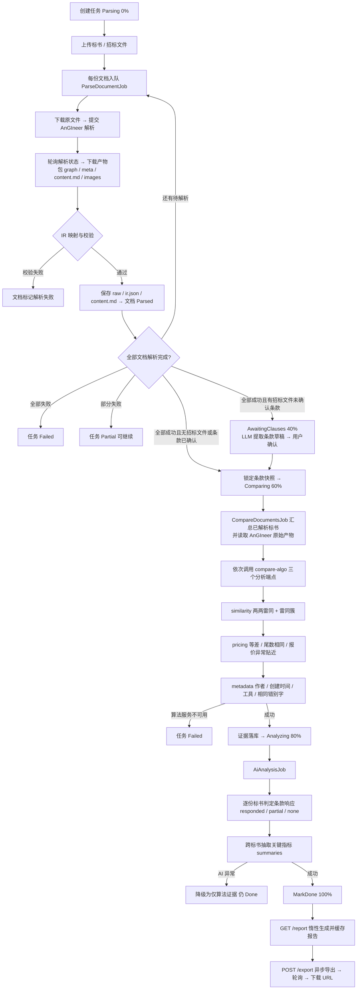

# DredgeAI.BidCompare

## About this solution

This is a layered startup solution based on [Domain Driven Design (DDD)](https://docs.abp.io/en/abp/latest/Domain-Driven-Design) practises. All the fundamental ABP modules are already installed. 

### Pre-requirements

* [.NET 8.0+ SDK](https://dotnet.microsoft.com/download/dotnet)
* [Node v18 or 20](https://nodejs.org/en)

### Configurations

The solution comes with a default configuration that works out of the box. However, you may consider to change the following configuration before running your solution:


### Before running the application

#### Generating a Signing Certificate

In the production environment, you need to use a production signing certificate. ABP Framework sets up signing and encryption certificates in your application and expects an `openiddict.pfx` file in your application.

This certificate is already generated by ABP CLI, so most of the time you don't need to generate it yourself. However, if you need to generate a certificate, you can use the following command:

```bash
dotnet dev-certs https -v -ep openiddict.pfx -p 80f36add-4196-4445-abca-779af2677d28
```

> `80f36add-4196-4445-abca-779af2677d28` is the password of the certificate, you can change it to any password you want.

It is recommended to use **two** RSA certificates, distinct from the certificate(s) used for HTTPS: one for encryption, one for signing.

For more information, please refer to: https://documentation.openiddict.com/configuration/encryption-and-signing-credentials.html#registering-a-certificate-recommended-for-production-ready-scenarios

> Also, see the [Configuring OpenIddict](https://docs.abp.io/en/abp/latest/Deployment/Configuring-OpenIddict#production-environment) documentation for more information.

#### Install Client-Side Libraries

Run the following command in the directory of your final application:

```bash
abp install-libs
```

> This command installs all NPM packages for MVC/Razor Pages and Blazor Server UIs and this command is already run by the ABP CLI, so most of the time you don't need to run this command manually.

#### Create the Database

Run `DredgeAI.BidCompare.DbMigrator` to create the initial database. This should be done in the first run. It is also needed if a new database migration is added to the solution later.

### Solution structure

This is a layered monolith application that consists of the following applications:

* `DredgeAI.BidCompare.DbMigrator`: A console application which applies the migrations and also seeds the initial data. It is useful on development as well as on production environment.

### Deploying the application

Deploying an ABP application is not different than deploying any .NET or ASP.NET Core application. However, there are some topics that you should care about when you are deploying your applications. You can check ABP's [Deployment documentation](https://docs.abp.io/en/abp/latest/Deployment/Index) before deploying your application.

### Additional resources

You can see the following resources to learn more about your solution and the ABP Framework:

* [Web Application Development Tutorial](https://docs.abp.io/en/abp/latest/Tutorials/Part-1)
* [Application Startup Template Structure](https://docs.abp.io/en/abp/latest/Startup-Templates/Application)

---

## 后端比标流程

比标是一条「创建任务 → 解析 → 确认条款 → 算法比对 → AI 分析 → 出报告」的异步流水线，每个环节由后台任务推进，前端通过任务状态与进度轮询。

### 总体流程



### 阶段说明

| 阶段 | 任务状态 | 进度 | 主要动作 |
|------|----------|------|----------|
| 解析 | `Parsing` | 按已解析份数 / 总份数 | 每份文档独立入队：下载原文件 → 提交 AnGIneer → 轮询完成 → 下载产物 → 映射 / 校验 IR → 落库 |
| 条款确认（可选） | `AwaitingClauses` | 40% | 仅当存在招标文件且未确认条款时进入：LLM 提取强制条款草稿 → 用户确认 → 锁定条款快照 |
| 两两比对 | `Comparing` | 60% | 汇总已解析标书的 AnGIneer 原始产物，依次调用 compare-algo 的 similarity / pricing / metadata，证据落库 |
| AI 分析 | `Analyzing` | 80% | 有条款快照时逐份标书做条款响应判定（responded / partial / none），并跨标书抽取关键指标 |
| 完成 | `Done` | 100% | 报告首次访问时惰性生成并缓存；导出走异步任务，完成后返回临时下载 URL |

### 失败策略

- 全部文档解析失败 → 任务 `Failed`，给出明确原因。
- 部分文档解析失败 → 任务 `Partial`，已成功文档继续参与比对。
- compare-algo 算法服务不可用 → 任务直接 `Failed`，不静默降级。
- AI 分析失败 / 超时 → 不阻塞任务：仅保留算法证据，任务仍 `Done`，进度消息标注「AI 分析暂不可用」。

## 密钥与部署配置（安全默认为开）

`appsettings.json` 不含任何密钥（连接串密码、MinIO 凭据、StringEncryption passphrase、本地存储签名密钥均为空占位）。运行时经环境变量注入，本地开发用仓库根目录 `.env`（从 `.env.example` 复制，已在 .gitignore）：

| 环境变量 | 配置节 | 说明 |
|---|---|---|
| `BIDCOMPARE_DB_CONNECTION` | `ConnectionStrings:Default` | PostgreSQL 连接串（Host / DbMigrator 共用） |
| `STORAGE_S3_ACCESSKEY` / `STORAGE_S3_SECRETKEY` | `Storage:S3` | MinIO/S3 凭据 |
| `STORAGE_LOCAL_SIGNING_SECRET` | `Storage:Local:SigningSecret` | 本地存储签名下载 URL 的 HMAC 密钥（Local provider 必填） |
| `STRING_ENCRYPTION_PASSPHRASE` | `StringEncryption:DefaultPassPhrase` | ABP 字符串加密 |
| `ANGINEER_API_KEY` | `AnGIneer:ApiKey` | AnGIneer docs-api |
| `LLM_API_KEY` / `LLM_ENDPOINT` / `LLM_MODEL` | `Llm` | OpenAI 兼容网关 |
| `AUTH_REQUIRE_HTTPS_METADATA` | `AuthServer:RequireHttpsMetadata` | 生产必须为 `true` |
| `SWAGGER_ENABLED` | `Swagger:Enabled` | 生产默认关闭 Swagger，显式 `true` 才开启 |

生产环境注意：

* Swagger 仅在 Development 或 `Swagger:Enabled=true` 时挂载。
* CORS 生产环境仅允许 `App:CorsOrigins` 精确枚举的域名（不再放行通配子域）。
* 本地存储（`Storage:Provider=Local`）不再暴露匿名 `/storage` 静态目录；下载链接为带过期时间的 HMAC-SHA256 签名 URL（`GET /api/compare/storage/file`）。
* 全部 `/api/compare/*` 业务端点要求认证 + `BidCompare.*` 权限，数据按创建者隔离。
