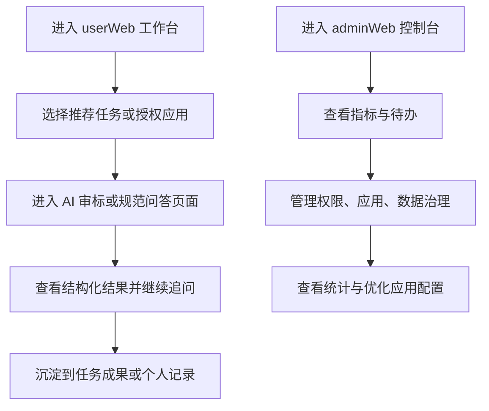

## 1. 产品概述
面向企业员工的 AI 平台原型，第一期仅交付 `userWeb` 与 `adminWeb` 两套前端中保真原型，用于产品评审、业务演示与后续研发对齐。
- 解决企业 AI 平台首页像聊天工具、业务入口混乱、管理侧只看报表而缺乏治理闭环的问题
- 目标价值是形成一套可展示、可评审、可继续演进的双端产品原型

## 2. 核心功能

### 2.1 用户角色
| 角色 | 进入方式 | 核心权限 |
|------|----------|----------|
| 普通员工 | 企业账号登录 | 查看授权应用、发起任务、查看个人结果 |
| 专业岗位用户 | 企业账号登录 | 使用专业场景应用、管理任务文件、查看结构化结果 |
| 平台管理员 | 企业账号登录 | 管理权限、应用、数据治理、统计分析 |

### 2.2 功能模块
1. **userWeb 首页工作台**：推荐任务、授权应用、最近任务、最近文件、个人效率区
2. **userWeb 应用广场**：按场景筛选 AI 应用并快速进入
3. **AI 审标应用页**：上传文档、分步分析、风险识别、报告导出
4. **规范问答应用页**：自然语言查询、条款命中、引用追溯、继续追问
5. **个人中心 / API 管理**：查看个人信息、授权范围、API Key 与配额
6. **adminWeb 管理工作台**：关键指标、待办告警、应用排行、审核提醒
7. **权限与应用管理**：用户角色权限、应用上下架、版本状态、可见范围
8. **数据治理与分析**：上传数据筛选、内容审核、调用统计、成本分析

### 2.3 页面详情
| 页面名称 | 模块名称 | 功能描述 |
|-----------|-------------|---------------------|
| userWeb 首页 | 推荐任务 | 按岗位与最近行为展示高频任务入口 |
| userWeb 首页 | 授权应用 | 展示已授权应用与收藏应用 |
| userWeb 首页 | 最近任务/文件 | 快速续做最近工作，弱化聊天历史 |
| 应用广场 | 场景筛选 | 按日常办公、专业业务、知识查询、开发接口筛选 |
| AI审标页 | 步骤流 | 展示上传、识别、风险分析、报告输出的完整流程 |
| AI审标页 | 文档与结果区 | 高亮原文、结构化风险清单、人工确认 |
| 规范问答页 | 查询区 | 支持关键词、自然语言、标准编号筛选 |
| 规范问答页 | 命中结果区 | 展示条款内容、适用范围、引用来源 |
| 个人中心 | 个人信息 | 展示岗位、部门、授权范围与偏好设置 |
| API管理 | Key 管理 | 展示 API Key、调用说明、额度与状态 |
| admin 工作台 | 指标卡片 | 展示调用量、活跃用户、异常告警、待审核数据 |
| 权限管理 | 角色权限表 | 管理角色、菜单、应用与数据权限 |
| 应用管理 | 应用列表 | 管理应用分组、上下架、版本与授权范围 |
| 数据治理 | 文件审核 | 审核用户上传数据、分类标签与处理状态 |
| 统计分析 | 趋势模块 | 展示调用趋势、应用排行、模型成本占比 |

## 3. 核心流程
普通员工从工作台发起任务，进入具体应用后完成上传、分析和结果查看；专业岗位用户在应用流中继续深度处理文档与标准；平台管理员在管理端完成权限分配、应用治理和数据分析。

## 4. 用户界面设计
### 4.1 设计风格
- 主色采用深蓝灰与亮青色点缀，传达企业级、专业和科技感
- 按钮采用圆角中等、轻投影和清晰分层状态
- 字体采用稳重的无衬线中文字体，标题强调层级，对正文保持高可读性
- 布局采用卡片化工作台 + 多栏业务页，避免传统聊天工具式侧边历史栏
- 图标建议使用线性风格，统一简洁、专业的企业产品语言

### 4.2 页面设计概览
| 页面名称 | 模块名称 | UI 元素 |
|-----------|-------------|-------------|
| userWeb 首页 | 欢迎区 | 平台标题、快捷入口、角色标签、搜索框 |
| userWeb 首页 | 工作台卡片 | 两列卡片、任务按钮、状态标签、最近成果 |
| 应用广场 | 应用卡片 | 场景标签、收藏按钮、进入按钮、说明文字 |
| AI审标页 | 三栏布局 | 步骤导航、文档预览、风险面板、追问区 |
| 规范问答页 | 双主栏布局 | 查询栏、答案卡片、引用面板、推荐问题 |
| admin 工作台 | 指标卡片 | 统计数字、趋势标签、待办列表、告警区 |
| admin 管理页 | 表格+侧边摘要 | 数据表、筛选栏、状态 Tag、操作按钮 |

### 4.3 响应式
- 采用桌面优先设计，适配常见办公屏幕
- 在中等宽度下卡片自动换行，复杂表格与多栏页保留桌面结构
- 交互重点放在鼠标点击和键盘可达性，不以移动端为第一优先级
