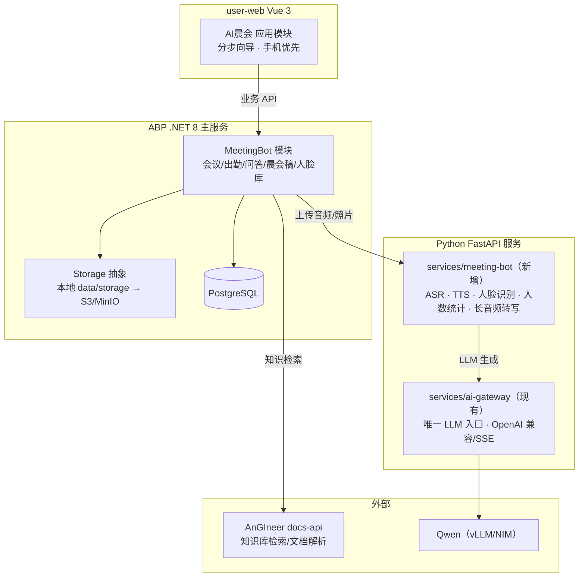

# AI 晨会模块设计（DredgeAI）
- 日期：2026-08-22
- 状态：已确认，待审阅
- 所属仓库：D:\AI\DredgeAI
- 配套文档：docs/prd-ai-platform-prototype.md、AGENTS.md、docs/bid-compare.md（模块文档风格参考）

## 1. 背景与目标
为工地晨会场景开发"AI 晨会"应用模块：主持人用手机浏览器打开应用，完成会前信息录入、晨会稿生成与审核、现场点名、会议录音转写、现场语音问答和会后报告。

核心价值：把晨会从"口头交底、事后无记录"变成"知识增强、全程留痕、自动出勤"。

## 2. 已确认需求与决策
| 决策点 | 结论 |
|---|---|
| 应用形态 | DredgeAI 内的 Web 应用模块，现场用手机浏览器打开，开发用电脑摄像头/麦克风调试 |
| 操作台布局 | 分步向导，一步一屏（录入 → 晨会稿 → 点名 → 会议 → 报告） |
| v1 范围 | 完整闭环：语音问答 + 摄像头点名/人数 + 会后报告通知 |
| 开发方式 | 直连真实服务（DGX/ai-gateway + AnGIneer） |
| 点名方式 | v1 手动旋转支架拍集体照 + 漏检补扫；v2 电动旋转支架 |
| 人脸库 | 批量导入花名册照片 + 现场补录覆盖 |
| 技术栈 | 前端 Vue 3（跟随现有约定）；实时语音/视觉编排用新增 Python/FastAPI 服务 |
| 项目位置 | D:\AI\DredgeAI（已有 monorepo 架子） |

## 3. 架构总览

## 4. 模块划分
### 4.1 user-web 前端模块（AI晨会）
按 AGENTS.md「新模块开发清单」执行：类型 → URL → mock → API 模块 → mock 路由 → 注册 → router manifest → 页面 → typecheck。
- 应用 manifest：`id: 'ai-meeting'`，`route: '/ai-meeting'`，`category: '施工'`，`title: 'AI晨会'`
- 页面目录：`user-web/src/views/ai-meeting/`（index.vue 为唯一状态持有组件，子组件只收 props/emit 事件）
- 复用 `@shared/web` 组件：PageHeader、SectionCard、AppButton、DataSkeleton、ErrorBoundary
- 样式：LESS 变量 + BEM，禁止硬编码颜色/像素；按钮统一 AppButton
- 浏览器能力：`getUserMedia` 采集摄像头/麦克风，`MediaRecorder` 录音，AudioContext 播放 TTS
- 手机优先：分步向导在窄屏下全宽单列；桌面调试时居中限宽

### 4.2 services/meeting-bot（新增，Python/FastAPI）
仿 `services/compare-algo`、`services/ai-gateway` 的工程模式（pyproject.toml + uv + pytest）。部署在 GPU/DGX 侧。
meeting-bot 与其依赖模型（FireRedASR/TTS、InsightFace、YOLO）部署在 DGX 上；LLM 与 Embedding 由独立容器/进程提供（见第 5 节清单）。
| 端点 | 功能 | 依赖模型 |
|---|---|---|
| `POST /asr` | 音频 → 文本（交互用，流式可后续升级） | FireRedASR（AED 版） |
| `POST /tts` | 文本 → 音频字节 | FireRedTTS-1S |
| `POST /recognize` | 照片/视频帧 → 人脸识别结果（去重聚合） | InsightFace（SCRFD + ArcFace） |
| `POST /count` | 照片 → 人数统计 | YOLO + ByteTrack |
| `POST /transcribe` | 长音频 → 全文转写（会后异步） | FireRedASR（LLM 版） |
| `POST /enroll` | 单人照片 → 人脸特征入库/更新 | InsightFace |

设计要点：
- 模型加载为进程内单例，避免每请求加载
- 阈值、模型路径、GPU 设备通过环境变量/配置管理
- 所有端点幂等，支持超时与重试语义

### 4.3 backend ABP MeetingBot 模块
在 `backend/DredgeAI.BidCompare` 中新增领域模块，遵循 ABP 分层（Domain / Application / Application.Contracts / HttpApi / EntityFrameworkCore）：
- 领域实体与聚合：MeetingRecord、SpeechDraft、AttendanceRecord、QaRecord、WorkerProfile
- 应用服务：会议 CRUD、晨会稿生成编排、点名结果落库、问答编排、报告生成
- 集成：调用 meeting-bot（HttpClient）、ai-gateway（复用现有 ILlmGateway）、AnGIneer（复用 HttpAnGineerClient）
- 存储：录音/录像/照片/报告走现有 IFileStorage；结构化数据走 PostgreSQL

### 4.4 复用服务
- `services/ai-gateway`：晨会稿生成、问答生成的唯一 LLM 入口；LLM_CONFIGS 指向 Qwen（vLLM/NIM）
- AnGIneer docs-api：知识检索（规范/SOP/项目资料），生成晨会稿时补充安全要点
- `packages/shared`：跨端类型、请求封装、样式变量

## 5. DGX 模型与 API 清单
| 模型 | 用途 | 服务方式 | API 端点 | 调用方 |
|---|---|---|---|---|
| Qwen3.6-35B-A3B | 晨会稿生成、问答生成、意图分级 | vLLM 或 NIM（OpenAI 兼容） | `POST /v1/chat/completions`（含 SSE 流式）、`GET /v1/models` | ai-gateway（LLM_CONFIGS） |
| bge-m3 | 知识检索向量化（1024 维） | TEI 或 FastAPI 包装（OpenAI 兼容） | `POST /v1/embeddings` | AnGIneer 检索、meeting-bot 本地检索 |
| FireRedASR（AED 交互版） | 现场问答语音转写 | meeting-bot 内嵌 | `POST /asr`（音频 → 文本） | ABP 问答链路 |
| FireRedASR（LLM 精转写版） | 会后长录音转写 | meeting-bot 内嵌 | `POST /transcribe`（长音频 → 全文） | ABP 会后任务 |
| FireRedTTS-1S | 晨会稿/回答语音合成 | meeting-bot 内嵌 | `POST /tts`（文本 → 音频，流式） | ABP 问答链路、前端播放 |
| pVAD + Turn-Detector | 端点检测、判停、打断 | meeting-bot 进程内（可选暴露 `POST /vad`、`POST /turn`） | 进程内调用优先 | meeting-bot 会话状态机 |
| InsightFace（SCRFD + ArcFace） | 人脸检测与识别 | meeting-bot 内嵌 | `POST /recognize`、`POST /enroll` | ABP 点名流程 |
| YOLO + ByteTrack | 人数统计 | meeting-bot 内嵌 | `POST /count` | ABP 点名流程 |

部署形态与约束：
- LLM 与 Embedding 作为独立容器/进程（vLLM/NIM、TEI 或自包装），监听独立端口，与 meeting-bot 互不阻塞
- ASR/TTS/VAD/人脸/人数统一由 meeting-bot 托管，模型进程内单例加载，避免每请求加载
- 所有 DGX API 只走内网，ABP 通过 HttpClient 调用，鉴权用共享密钥（Header），不暴露公网
- 资源估算：Qwen 35B-A3B FP8 约 40–50GB，其余模型合计约 10GB；DGX Spark 128GB 统一内存可同时运行
- 端口规划建议：vLLM/NIM 8000、Embedding 8001、meeting-bot 8101（写入 .env 配置）

人数统计策略：主链路使用 YOLO+ByteTrack（确定性计数 + 跨帧去重），出勤以人脸识别 + 跟踪结果为准；Qwen（VL 版）仅作为"AI 目测人数"展示与异常兜底（如 YOLO 结果突变时复核），不承担出勤计数。若部署的是纯文本版 Qwen，则完全不参与视觉任务。

## 6. 数据模型
| 实体 | 关键字段 |
|---|---|
| MeetingRecord | Id、Date、PreInfoJson（前置信息 A）、SpeechDraftId、Status（draft/prepared/rollcall/ongoing/completed）、StartedAt、EndedAt、TranscriptFile、VideoFile、ReportFile、CreatedBy |
| SpeechDraft | Id、MeetingRecordId、Content（语言 B）、GeneratedAt、EditedAt、Status |
| AttendanceRecord | Id、MeetingRecordId、WorkerId、Status（present/absent/late/unrecognized）、Method（photo/scan）、Confidence、RecognizedAt、PhotoFile |
| QaRecord | Id、MeetingRecordId、QuestionText、AnswerText、IntentType（knowledge/chitchat/meeting）、SourcesJson（AnGIneer 证据）、AudioFile、CreatedAt |
| WorkerProfile | Id、Name、EmployeeNo、Team（班组）、FaceStatus（enrolled/pending）、FacePhotosJson、Active |

## 7. API 契约草案（前端 ↔ ABP）
| 方法/路径 | 说明 |
|---|---|
| POST /api/app/meeting-record | 创建会议（携带前置信息 A） |
| POST /api/app/meeting-record/{id}/generate-speech | 生成晨会稿（AnGIneer 检索 + ai-gateway），返回任务或草稿 |
| GET /api/app/meeting-record/{id}/speech-draft | 获取晨会稿 |
| PUT /api/app/meeting-record/{id}/speech-draft | 保存主持人编辑 |
| POST /api/app/meeting-record/{id}/start | 开始会议（进入点名） |
| POST /api/app/attendance/recognize | 上传照片 → meeting-bot 识别 → 出勤落库 |
| GET /api/app/meeting-record/{id}/attendance | 出勤列表 |
| POST /api/app/meeting-record/{id}/qa | 文本问答（语音链路：浏览器录音 → meeting-bot /asr → 本接口 → meeting-bot /tts） |
| POST /api/app/meeting-record/{id}/complete | 结束会议，触发转写与报告 |
| GET /api/app/meeting-record/{id}/report | 获取报告 |
| POST /api/app/workers/import | 花名册照片批量导入 |
| POST /api/app/workers/{id}/face | 现场补录人脸 |

语音链路 v1 采用"浏览器录音 → 上传 → ASR → 问答 → TTS → 播放"的同步 HTTP 模式；v2 若时延不达标，升级为 WebSocket/SSE 流式。

## 8. 页面流程（分步向导）
1. **会前录入**：日期、天气、今日任务、风险点 → 保存
2. **晨会稿**：点"生成"→ 展示晨会稿 B → 主持人编辑 → 确认
3. **点名**：拍照/手动支架扫一圈 → 出勤列表（应到/实到/缺勤/未识别）→ 补扫漏检
4. **会议**：TTS 播放晨会稿（或主持人朗读）→ 全程录音 → 按住说话问答
5. **报告**：转写稿 + 出勤 + 问答记录 → 查看/导出 → 可选企业微信推送

## 9. 数据流
- **会前**：录入 A → ABP 调 AnGIneer 检索 + ai-gateway 生成 B → 前端审核
- **会中**：照片 → meeting-bot 人脸识别 → 出勤落库；音频 → meeting-bot ASR → 问答编排 → TTS 回放
- **会后**：长音频 → meeting-bot 精转写 → 报告生成 → 存储/推送

## 10. 错误处理与降级
- ai-gateway 不可用 → 晨会稿生成与问答返回明确提示，不静默失败
- AnGIneer 检索失败 → 降级为 LLM 直答，答案标注"无知识库证据"
- meeting-bot 不可用 → 点名提示重试；问答降级为文本输入
- 人脸置信度低于阈值 → 归入"未识别"补扫列表
- 浏览器录音：需用户手势触发（iOS 限制），MediaRecorder 分段上传；权限拒绝时给出引导
- 网络波动 → 前端 loading + 重试；语音上传支持断线重试

## 11. 测试策略
- 前端：`pnpm run typecheck` + vitest（状态机与 API 模块单测）
- meeting-bot：pytest（ASR/TTS/人脸端点用 mock 模型）
- ABP：`dotnet test`（会议、出勤领域测试）
- 联调：电脑摄像头/麦克风替代手机跑通全流程，再切手机真机

## 12. 版本范围（v1 边界）
v1 包含：晨会稿生成、现场点名（手动支架 + 补扫）、全程录音转写、语音问答、报告与企业微信通知。

v1 不包含：电动旋转支架、固定机位自动点名、多路视频、多人同时问答、原生 App 壳（v1 为浏览器 PWA）。

## 13. 风险与开放问题
1. 真实服务凭据与地址：DGX vLLM 端点、ai-gateway 的 LLM_CONFIGS、AnGIneer API Key、FireRedASR/TTS 的部署位置（meeting-bot 所在 GPU 机）
2. 人脸合规：工地人脸采集需告知同意、数据本地化存储、定期清理
3. 浏览器兼容性：Chrome/Edge 桌面优先，手机端需验证 getUserMedia/MediaRecorder 行为（尤其 iOS Safari）
4. 长录音转写耗时：会后异步任务，避免阻塞报告生成
5. 现场网络：语音/照片上传大小与带宽；必要时压缩后再上传
6. NIM 目录是否覆盖 Qwen3.6-35B-A3B；若没有则退回 vLLM/SGLang（NVFP4 + 投机解码有 DGX Spark 社区配方）
7. DGX Spark 为 ARM 架构，vLLM/insightface/onnxruntime 等依赖需先做兼容性 PoC，个别可能需源码编译

## 14. 待办（进入实施计划前）
- 确认 DGX/ai-gateway/AnGIneer 实际可用的地址与密钥
- 确认 DGX 上 vLLM/NIM、Embedding、meeting-bot 的端口规划与内网可达性
- 跑通 FireRedASR/TTS/InsightFace 在 DGX（ARM）上的最小 PoC
- 确认企业微信通知使用 webhook 还是现有平台通道
