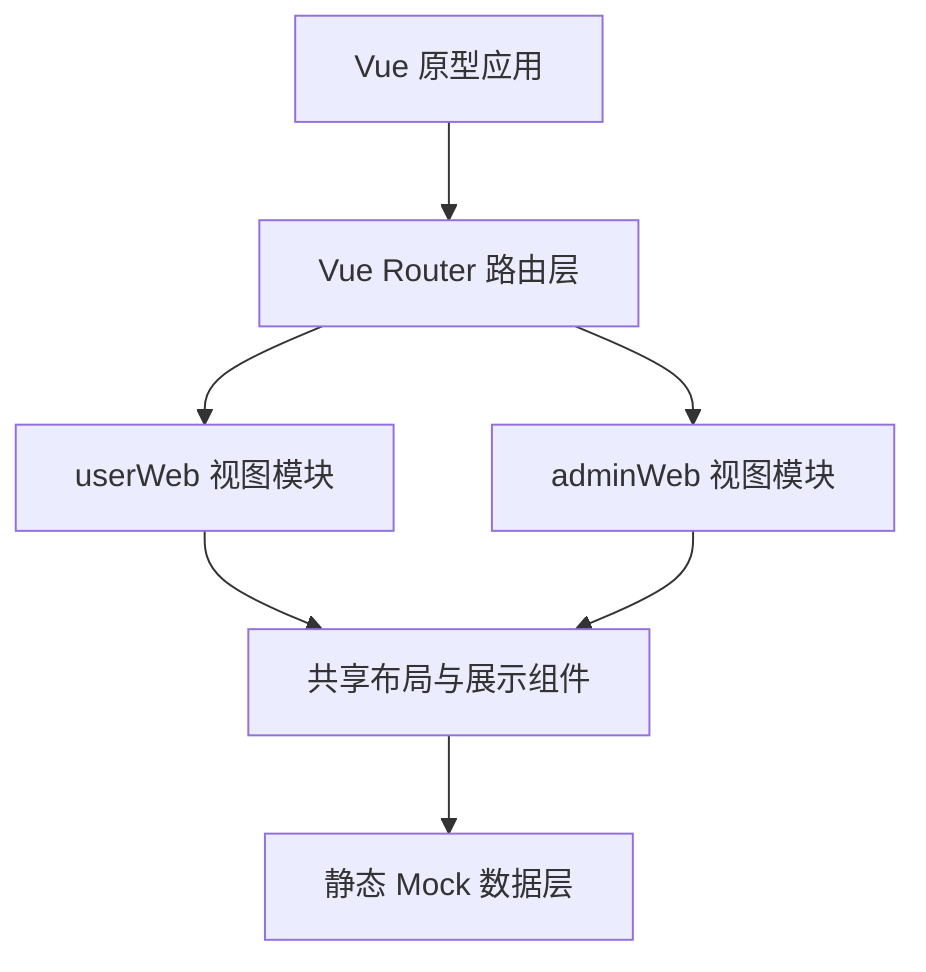
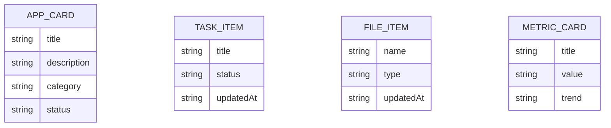

## 1. 架构设计


## 2. 技术描述
- 前端：Vue 3 + TypeScript + Vite
- 路由：Vue Router 4
- 状态管理：Pinia
- UI 组件：Ant Design Vue 4
- 样式：Less
- 数据来源：本地静态 Mock 数据，无后端依赖

## 3. 路由定义
| 路由 | 用途 |
|-------|---------|
| / | 默认重定向到 `userWeb` 首页 |
| /user/dashboard | userWeb 首页工作台 |
| /user/apps | userWeb 应用广场 |
| /user/bid-review | AI审标原型页 |
| /user/standards | 标准查询原型页 |
| /user/profile | 个人中心 |
| /user/api | API 管理 |
| /admin/dashboard | adminWeb 管理工作台 |
| /admin/permissions | 权限管理 |
| /admin/applications | 应用管理 |
| /admin/data | 数据治理 |
| /admin/analytics | 统计分析 |

## 4. API 定义
当前阶段不接入真实后端 API，统一使用 TypeScript 静态数据对象模拟页面状态。

```ts
export interface MetricCard {
  title: string
  value: string
  trend?: string
}

export interface AppCard {
  title: string
  description: string
  category: string
  status?: string
}
```

## 5. 服务端架构图
当前阶段无服务端实现，本原型只输出双端前端页面结构。

## 6. 数据模型
### 6.1 数据模型定义


### 6.2 数据定义说明
- `APP_CARD`：描述 userWeb 和 adminWeb 中展示的应用与管理对象
- `TASK_ITEM`：描述 userWeb 首页和任务列表中的任务卡片
- `FILE_ITEM`：描述用户最近文件与治理文件列表
- `METRIC_CARD`：描述 adminWeb 指标卡片与分析看板数据
